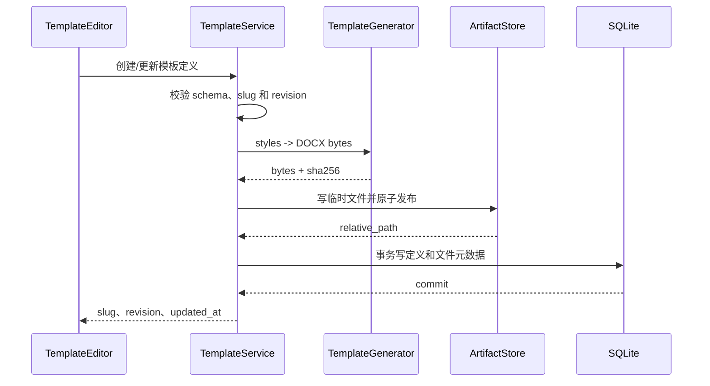

# 自定义模板数据库存储设计

> 状态：已实现  
> 适用范围：MarkFlow 桌面端的自定义模板；内置模板继续随应用发布  
> 结论：**SQLite 保存模板定义并作为唯一事实来源，`reference.docx` 作为可重建的派生文件存放在用户数据目录。**

当前实现进度（2026-08-09）：

- 已完成 `custom_templates` 表与 Alembic 迁移、数据库 Repository。
- 已完成内容哈希 artifact 存储、路径约束、完整性校验及缺失文件自动重建。
- 已完成统一 `TemplateService`、API CRUD、revision 乐观锁、转换链路注入和旧 YAML 幂等导入。
- 已完成前端 revision 透传、修订历史查看/恢复和已删除模板恢复。
- 已完成延迟孤儿文件回收，以及转换任务的完整模板定义快照。
- 已完成后端、API、迁移回填和前端构建验证。

## 1. 当前实现

目前自定义模板没有进入数据库，存在三处状态：

| 数据 | 当前存储位置 | 读写方 |
| --- | --- | --- |
| 已保存模板的元数据和样式 | `backend/templates/custom/{slug}/template.yaml` | `TemplateGenerator` 写入，`TemplateManager` / `TemplateGenerator` 读取 |
| Word 参考文档 | `backend/templates/custom/{slug}/reference.docx` | `TemplateGenerator` 生成，Pandoc 转换时读取 |
| 尚未提交的新建草稿 | 浏览器 `localStorage`，键为 `markflow.custom-template-draft.v2` | `TemplateEditor.tsx` |

现有调用链如下：

1. 前端调用 `POST/PUT /api/v1/templates`。
2. `backend/app/api/router.py` 把请求交给 `TemplateGenerator.save_custom_template()`。
3. 生成器创建 `templates/custom/{slug}`，先写 `reference.docx`，再写 `template.yaml`。
4. 模板列表通过 `TemplateManager.list_templates()` 扫描内置目录和 `custom/` 子目录。
5. 转换时 `TemplateManager` 再按 slug 定位目录，把 `reference.docx` 路径交给 Pandoc，并从 YAML 读取表格、页眉等配置。

数据库当前只包含 `conversion_jobs` 和 `conversion_artifacts`。数据库文件已经稳定落在 `settings.data_dir/markflow.sqlite3`，并通过 Alembic 管理版本。

### 1.1 当前方案的问题

- **打包路径不适合用户数据**：冻结运行时的 `TEMPLATES_DIR` 指向 PyInstaller 的 `_MEIPASS/templates`。这是应用资源目录，不应承载跨版本、跨启动持久化的用户数据。
- **YAML 与 DOCX 不是原子更新**：生成 DOCX 成功、写 YAML 失败或进程中断时，会出现半更新状态。
- **查询和约束较弱**：唯一性、版本号、更新时间只能依赖目录扫描和业务代码，无法利用数据库事务和索引。
- **缓存容易过期**：`TemplateManager` 缓存 YAML，但模板写入由另一个对象完成，没有统一的缓存失效边界。
- **备份与恢复不明确**：应用升级、模板目录变化或单个文件损坏后，缺少可验证、可重建的权威数据源。
- **后续能力难扩展**：乐观锁、模板复制、排序、导入导出、修订历史等能力基于目录实现会越来越复杂。

## 2. 设计目标与边界

### 2.1 目标

- 自定义模板在开发环境和打包环境中都可靠持久化。
- 模板的创建、更新、删除和唯一性判断由 SQLite 事务保证。
- 数据库或派生文件异常时，可以检测并自动修复。
- 保持现有 API 和前端交互基本兼容，分阶段迁移。
- 内置模板与用户模板仍可通过同一个 slug 解析接口使用。

### 2.2 不在本期范围

- 不把内置模板导入数据库；内置模板仍是随版本发布的只读资源。
- 不把 `reference.docx` 作为 BLOB 存入 SQLite。Pandoc 最终需要文件路径，BLOB 会增加数据库写放大、备份体积和临时文件管理成本。
- 不把前端未提交草稿立即写入数据库。当前是单用户桌面应用，保留 `localStorage` 自动草稿即可；若以后支持多设备同步，再单独设计 `template_drafts`。
- 不在修订历史中保存用户文档内容；历史只记录模板定义和对应派生文件索引。

## 3. 推荐存储模型

### 3.1 权威数据与派生数据

| 类型 | 存储位置 | 定位 |
| --- | --- | --- |
| 内置模板 YAML、DOCX、Lua filter | 应用资源 `TEMPLATES_DIR/{slug}` | 只读、随应用版本发布 |
| 自定义模板定义 | `DATA_DIR/markflow.sqlite3` | **唯一事实来源** |
| 自定义模板参考文档 | `DATA_DIR/template-artifacts/{template_id}/{sha256}.docx` | 可校验、可重建的派生文件 |
| 新建过程中的未提交草稿 | 前端 `localStorage` | 临时状态，不参与转换 |

自定义模板的 YAML 不再作为运行时必需文件。导出模板时可根据数据库记录临时生成 YAML，以继续支持可读、可移植的交换格式。

### 3.2 数据表

新增 Alembic 迁移 `0002_custom_templates.py`，建立 `custom_templates`：

| 字段 | 类型 | 约束/用途 |
| --- | --- | --- |
| `id` | `String(36)` | UUID 主键；文件目录使用该值，避免重命名影响路径 |
| `slug` | `String(128)` | `UNIQUE NOT NULL`；仅允许 `[a-z0-9_-]+` |
| `name` | `String(255)` | `NOT NULL` |
| `description` | `Text` | `NOT NULL DEFAULT ''` |
| `author` | `String(255)` | `NOT NULL DEFAULT 'MarkFlow'` |
| `version` | `String(32)` | 模板的业务版本，默认 `1.0.0` |
| `target_formats_json` | `JSON` | 目标格式数组 |
| `styles_json` | `JSON` | 完整、通过 Pydantic 校验的样式定义 |
| `schema_version` | `Integer` | 模板定义结构版本，首版为 `1` |
| `revision` | `Integer` | 每次更新加一，用于乐观锁 |
| `artifact_relative_path` | `Text NULL` | 相对 `DATA_DIR` 的 DOCX 路径，不保存绝对路径 |
| `artifact_sha256` | `String(64) NULL` | 派生文件完整性校验 |
| `artifact_generator_version` | `String(32) NULL` | 生成器版本；算法升级时触发重建 |
| `artifact_updated_at` | `DateTime NULL` | 最近成功生成时间 |
| `created_at` | `DateTime` | UTC 创建时间 |
| `updated_at` | `DateTime` | UTC 更新时间并建立索引 |

约束建议：

- 数据库唯一约束保证自定义模板 slug 不重复；服务层还需拒绝与内置模板 slug 冲突。
- `styles_json` 和 `target_formats_json` 写入前必须经过现有 Pydantic schema 校验，不能把数据库 JSON 当作可信输入。
- 首版采用硬删除数据库记录，使删除后可以重新使用同一 slug。派生文件延迟清理，避免删除与正在进行的转换互相影响。
- SQLite 的 JSON 类型实际以文本保存是可接受的；这些字段以整对象读写为主，不需要过度拆表。

### 3.3 修订历史与转换快照

`0003_template_history_and_snapshots` 已增加：

- `custom_template_revisions`：按稳定模板 UUID 和 revision 保存创建、更新、恢复、删除及旧数据迁移事件；删除当前模板不会删除历史。
- `conversion_jobs.template_revision`：记录转换发生时使用的修订号。
- `conversion_jobs.template_snapshot_json`：保存当时完整的名称、版本、样式和目标格式定义，模板后续修改或删除不影响历史解释。

恢复任意历史版本时不会覆盖历史记录，而是生成一个新的 `restored` 修订。已删除模板也可使用原 UUID 和连续 revision 恢复；如果原 slug 已被其他模板占用则返回 409。

### 3.4 为什么文件名使用内容哈希

生成路径使用 `{template_id}/{sha256}.docx`，而不是固定的 `reference.docx`：

- 新版本可先完整写好，再切换数据库指针，不会让 Pandoc 读到写了一半的文件。
- 正在执行的转换可以继续使用旧版本文件。
- 文件内容可通过路径和数据库哈希快速校验。
- 更新成功后旧文件可由后台或下次启动时做延迟垃圾回收。

## 4. 服务分层

建议将当前“扫描、持久化、生成”混合职责拆成四层：

```text
API Router
   └── TemplateService                 # 用例、校验、事务边界
       ├── BuiltinTemplateCatalog      # 只读扫描应用内置模板
       ├── CustomTemplateRepository    # SQLite CRUD
       ├── TemplateArtifactStore       # DATA_DIR 下的原子文件写入/校验/回收
       └── TemplateGenerator           # 纯函数：styles -> DOCX bytes
```

建议职责如下：

- `TemplateGenerator` 保留 `generate_reference()`，移除 `save/load/list/delete_custom_template()` 等持久化方法。
- `CustomTemplateRepository` 与现有 `ConversionRepository` 一样接收 `session_factory`，封装实体与领域对象转换。
- `TemplateArtifactStore` 接收 `settings.data_dir`，只接受模板 UUID 和受控文件名；写入使用同目录临时文件加原子替换。
- `BuiltinTemplateCatalog` 可由现有 `TemplateManager` 的只读逻辑演进而来。
- `TemplateService` 合并内置和自定义列表，并向转换流程提供统一的 `ResolvedTemplate`。

`ResolvedTemplate` 至少应包含：

```python
class ResolvedTemplate:
    slug: str
    styles: dict
    reference_doc: Path | None
    lua_filters: list[Path]
    is_custom: bool
    revision: int | None
```

自定义模板不允许指定任意 Lua filter 路径。内置 Lua filter 继续来自受信任的应用资源；将来若支持用户脚本，需要单独做权限和安全设计。

## 5. 核心流程

### 5.1 创建和更新



具体规则：

1. 在修改数据库前完成请求校验和 DOCX 生成；生成失败时数据库不变。
2. 派生文件先写入同目录的 `.tmp` 文件，`fsync` 后原子重命名为哈希文件。
3. 数据库事务只保存相对路径、哈希和模板定义。
4. 若数据库提交失败，新文件成为无引用孤儿，但不会破坏旧模板；启动清理器可安全删除超过保留期的孤儿。
5. 更新请求携带 `revision`，执行 `UPDATE ... WHERE id=? AND revision=?`。受影响行数为 0 时返回 `409 Conflict`，避免覆盖另一个窗口的修改。
6. 数据库提交后再安排旧派生文件清理，不在请求事务中删除旧文件。

这是文件系统与 SQLite 之间可实现的“先发布不可见文件，再原子切换数据库指针”方案；无需引入分布式事务。

### 5.2 列表和详情

- 列表查询分别读取内置 catalog 和 `custom_templates`，在服务层合并。
- 内置模板优先保留固定顺序；自定义模板建议按 `updated_at DESC, name ASC` 排序。
- 详情接口对内置模板可以继续只读；编辑接口只允许 `is_custom=true` 的记录。
- 列表不应为了判断 `has_reference_doc` 每次遍历文件系统。自定义模板可依据 artifact 字段返回状态，真正使用前再校验文件。

### 5.3 转换时解析

1. `TemplateService.resolve(slug)` 先查内置模板，再查自定义模板。
2. 对自定义模板检查派生文件存在、SHA-256 正确且生成器版本兼容。
3. 文件缺失、损坏或生成器已升级时，使用 `styles_json` 重新生成并更新 artifact 指针；同一模板重建应加进程内锁，避免并发重复生成。
4. 返回稳定的哈希文件路径给 Pandoc，同时直接从数据库定义读取表格、页眉及 HTML/PDF 所需样式。
5. 转换任务创建时把 `template_slug` 和当时的 `revision` 写入任务选项快照，便于排查历史结果。

转换创建时会同时写入 `template_revision` 和 `template_snapshot_json`。历史列表只返回 revision 以控制响应大小，历史详情返回完整快照。

### 5.4 删除

1. 校验目标为自定义模板。
2. 数据库事务硬删除记录；列表和新转换立即不可见。
3. 不同步删除 artifact，交给延迟清理任务处理。
4. 如果当前前端选中了该模板，继续回退到 `academic`，保持现有行为。

## 6. API 兼容方案

现有路径可以保持不变：

| 方法与路径 | 调整 |
| --- | --- |
| `GET /api/v1/templates` | 改由 `TemplateService` 合并内置和数据库模板 |
| `POST /api/v1/templates` | 创建数据库记录和 artifact，冲突返回 409 |
| `GET /api/v1/templates/{slug}` | 自定义模板从数据库读取；内置模板是否返回详情可保持现状 |
| `PUT /api/v1/templates/{slug}` | 请求增加 `revision`；旧客户端暂可缺省，过渡期记录警告 |
| `DELETE /api/v1/templates/{slug}` | 删除数据库记录，artifact 延迟回收 |
| `POST /api/v1/templates/preview` | 保持无状态，不落库，直接返回生成的 DOCX |
| `GET /api/v1/templates/{id}/revisions` | 列出完整修订历史 |
| `GET /api/v1/templates/{id}/revisions/{revision}` | 读取指定修订定义 |
| `POST /api/v1/templates/{id}/revisions/{revision}/restore` | 恢复为新修订 |
| `GET /api/v1/template-revisions/deleted` | 列出可恢复的已删除模板 |

响应建议增加：

```json
{
  "id": "b178d59d-3d4d-4de8-98b2-c1d7c69751f4",
  "slug": "technical-report",
  "name": "技术报告",
  "revision": 3,
  "updated_at": "2026-08-09T10:20:30Z"
}
```

当前 `TemplateSaveResponse.path` 返回 `custom/{slug}`，它暴露了已经准备废弃的内部布局，且对前端没有实际价值。兼容期可保留并标记 deprecated，之后移除，不能改成绝对路径。

## 7. 旧数据迁移

迁移需要同时处理“数据库结构升级”和“现有 YAML 导入”，二者分开执行：

### 7.1 数据库结构迁移

- Alembic `0002_custom_templates` 只负责建表和索引。
- 应用启动完成数据库升级后，再由 `LegacyTemplateImporter` 扫描旧目录。
- 不在 Alembic 中访问模板文件，避免数据库迁移依赖运行目录和打包布局。

### 7.2 幂等导入流程

扫描已知旧位置：

- 当前版本的 `TEMPLATES_DIR/custom`；
- 如历史版本曾把模板复制到用户数据目录，则兼容扫描 `DATA_DIR/templates/custom`。

对每个子目录：

1. 读取并用 `TemplateSaveRequest` 校验 `template.yaml`。
2. 若 slug 与内置模板冲突，跳过并记录可操作的错误日志。
3. 若数据库不存在该 slug，重新由 `styles` 生成 DOCX并导入；不要盲目信任旧 `reference.docx`。
4. 若数据库已存在该 slug，跳过，保证每次启动执行仍然幂等。
5. 单个模板失败不能阻断应用启动；记录 slug、源路径和失败原因。
6. 至少跨一个稳定版本保留旧目录且只读，不自动删除。确认迁移稳定后再提供显式清理入口。

打包版本如果曾将用户模板写入 `_MEIPASS`，该目录通常无法作为可靠的跨启动数据源，已经丢失的文件无法由迁移恢复。新实现必须统一将自定义模板依赖注入到 `settings.data_dir`，不要再从模块级 `TEMPLATES_DIR` 推导可写位置。

## 8. 一致性、恢复与备份

### 8.1 启动检查

启动时执行轻量检查，不需要对所有 DOCX 都计算哈希：

- 删除超过 24 小时的 `.tmp` 文件。
- 删除超过 7 天且未被当前模板或任何修订引用的哈希文件。
- 对 artifact 字段为空或文件缺失的记录标记为待重建；可延迟到首次使用时生成。

完整哈希校验可在首次转换、模板详情页或“检查数据”功能中执行。

### 8.2 自愈

数据库定义存在但 DOCX 丢失时，模板仍是可恢复的。服务用 `styles_json` 重新生成 artifact；只有定义本身无法通过当前 schema/生成器处理时，才返回明确的 `422` 或 `500` 并保留原始记录供诊断。

### 8.3 备份

- 最小备份只需 `markflow.sqlite3`，因为 DOCX 可重建。
- 快速恢复备份可同时包含数据库和 `template-artifacts/`。
- 复制启用 WAL 的 SQLite 数据库时应使用 SQLite backup API，或在应用关闭后同时处理主库、`-wal` 和 `-shm`，不能只复制正在使用的主文件。

## 9. 安全与校验

- slug 必须在 API、导入器和 repository 边界重复验证，并禁止 `.`、斜杠及路径分隔符。
- artifact 路径始终由服务根据 UUID 和 SHA-256 生成，并验证解析后的绝对路径仍位于 `DATA_DIR/template-artifacts` 内。
- 限制 `styles_json`、名称和描述大小，防止异常请求造成数据库或生成器资源消耗；建议单个定义序列化后不超过 256 KiB。
- `target_formats` 使用枚举白名单。
- 不接受数据库或 YAML 中的任意本地路径作为 reference doc 或 filter。

## 10. 分阶段实施

### 阶段 A：建立数据库能力

1. 增加 `CustomTemplateEntity`、Alembic 迁移和 repository 单元测试。
2. 增加 `TemplateArtifactStore`，覆盖原子写、哈希校验、路径越界和缺失文件测试。
3. 将 `TemplateGenerator` 收敛为无持久化状态的生成器。

### 阶段 B：接入业务链路

1. 增加 `TemplateService` 并在 `app.main.lifespan()` 中注入 `database.session_factory` 与 `settings.data_dir`。
2. API 的自定义模板 CRUD 改走 service。
3. 转换解析、表格配置、页眉配置和样式读取统一改走 `resolve()`，避免一部分读数据库、一部分仍读 YAML。
4. 前端加入 `revision`，处理 409 冲突并提示重新加载。

### 阶段 C：迁移和收尾

1. 启动时运行幂等 legacy importer，并增加导入成功/失败日志与测试夹具。
2. 至少一个版本保留旧目录读取兜底，但新写入只进入数据库和 `DATA_DIR/template-artifacts`。
3. 下一版本移除旧目录兜底和 `TemplateSaveResponse.path`。
4. 加入孤儿文件清理、数据检查和备份说明。

## 11. 验收标准

- 创建或修改模板后重启应用，模板和转换效果保持一致。
- 应用升级或安装目录改变后，自定义模板仍可用。
- 同名 slug 并发创建最多一个成功；过期 revision 更新返回 409。
- 模板生成失败时数据库中的旧版本不变。
- 数据库提交失败时旧模板仍可转换，新产生的孤儿文件可被清理。
- 手工删除或损坏某个派生 DOCX 后，首次使用能根据数据库定义自动重建。
- 旧 `templates/custom` 中的合法模板只导入一次；单个坏模板不阻断启动。
- 内置模板始终只读，且自定义模板不能覆盖同 slug 的内置模板。
- 删除模板不会破坏已经启动的转换任务；前端选中项按现有逻辑回退。

## 12. 最终决策摘要

采用“**内置模板走只读文件，自定义模板定义走 SQLite，生成 DOCX 走用户数据目录缓存**”的混合方案。数据库解决事务、唯一性、查询和演进问题；文件系统继续承担 Pandoc 所需的二进制输入；两者通过内容哈希、相对路径和可重建策略保持一致。该方案与 MarkFlow 已有的 SQLite、Alembic、repository 和 `DATA_DIR` 机制一致，改造范围可控，也为后续模板版本历史与导入导出留出了空间。
