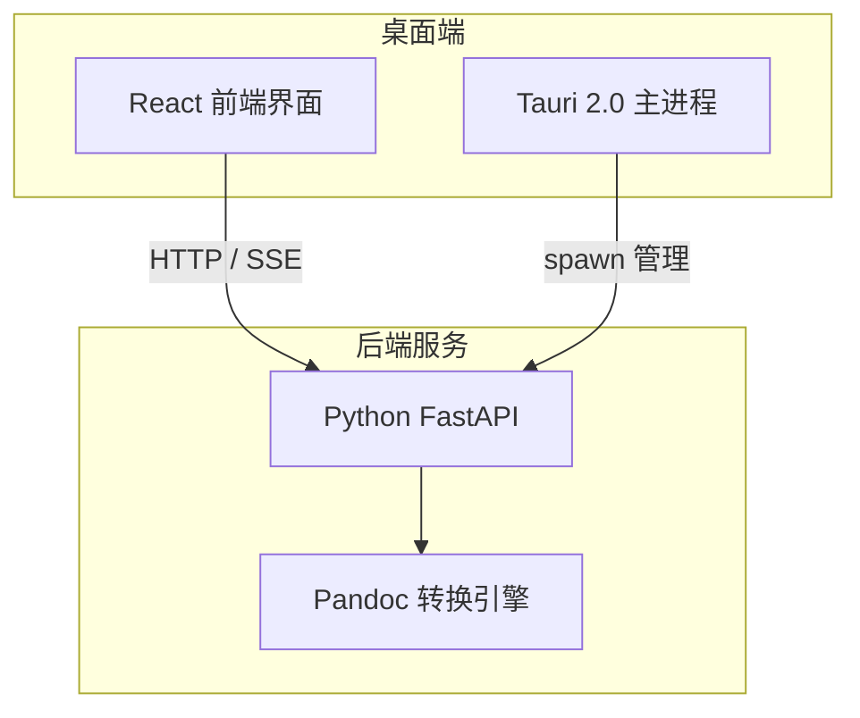
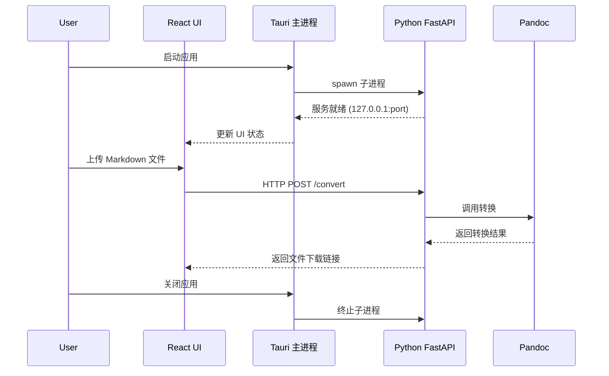

# 技术选型确认：React + FastAPI(Pandoc) + Tauri

## 一、整体架构确认

你的技术选型组合非常经典，参考了类似架构的成功案例：



**核心设计思路**：Tauri 负责桌面外壳和进程管理，Python FastAPI 承载 Pandoc 转换逻辑，React 负责 UI 渲染，前后端通过 HTTP 通信。


## 二、技术栈详细确认

### 2.1 桌面端：Tauri 2.0 ✅

**为什么选择 Tauri 而非 Electron**：

| 对比维度 | Tauri | Electron |
|----------|-------|----------|
| 安装包体积 | ~10-20 MB | ~70-100+ MB |
| 内存占用 | 更低 | 较高 |
| 后端语言 | Rust | Node.js |
| 启动速度 | 快 | 较慢 |

**Tauri 集成 Python 后端的两种方案**：

**方案一：Sidecar 模式（推荐）** ⭐

将 Python FastAPI 服务打包为独立可执行文件，Tauri 通过子进程管理：

```rust
// src-tauri/src/backend.rs
use std::process::{Command, Child};
use tauri::Manager;

struct BackendManager {
    process: Option<Child>,
}

impl BackendManager {
    fn start(&mut self, app_handle: &tauri::AppHandle) -> Result<(), String> {
        let exe_path = get_python_backend_path(app_handle);
        
        self.process = Some(
            Command::new(exe_path)
                .arg("--port")
                .arg("62581")
                .spawn()
                .map_err(|e| e.to_string())?
        );
        Ok(())
    }
    
    fn stop(&mut self) {
        if let Some(mut child) = self.process.take() {
            let _ = child.kill();
        }
    }
}
```

**方案二：tauri-plugin-python 插件**

官方插件，支持在 Rust 中直接调用 Python 代码：

```rust
// 使用 PyO3 特性（推荐生产环境）
tauri-plugin-python = { version = "0.3.7", features = ["pyo3"] }
```

但该方案 CPython 部署较复杂，**推荐使用 Sidecar 模式**。

### 2.2 后端：FastAPI + Pandoc ✅

**核心架构参考**：

现有开源项目 `pandoc-api` 展示了完整的 FastAPI + Pandoc 实现：

```python
from fastapi import FastAPI, File, UploadFile, Query
from fastapi.responses import FileResponse

app = FastAPI()

@app.post("/convert/html/")
async def convert_html(
    name: str = Query(default="index.html"),
    with_toc: bool = Query(default=False),
    markdown_file: UploadFile = File(...),
) -> FileResponse:
    # 使用 Pandoc 转换
    output_path = pypandoc.convert_file(
        markdown_file.file,
        'html',
        outputfile=name,
        extra_args=['--standalone', '--toc'] if with_toc else []
    )
    return FileResponse(output_path, media_type="text/html")
```

**关键能力点**：

| 功能 | 实现方式 |
|------|----------|
| 文件上传 | FastAPI `UploadFile` |
| 格式转换 | pypandoc / 命令行调用 |
| 进度推送 | WebSocket / SSE |
| 并发控制 | 信号量 / 任务队列 |
| 临时文件管理 | `tempfile` 模块 |

### 2.3 前端：React + TypeScript ✅

推荐使用 Vite 作为构建工具，配合 Tauri 开发体验最佳。


## 三、后端打包方案

为了将 Python 服务打包为 Tauri 可调用的独立可执行文件：

| 工具 | 优点 | 缺点 |
|------|------|------|
| **PyInstaller** | 成熟稳定，社区丰富 | 打包体积较大 |
| **Nuitka** | 体积更小，性能更好 | 编译时间长 |
| **PyOxidizer** | Rust 生态，可静态链接 | 配置复杂 |

**推荐 PyInstaller**：

```bash
# 安装
pip install pyinstaller

# 打包为单文件（适合测试）或目录模式（生产推荐）
pyinstaller --onedir --name pandoc-service main.py
```

**打包后目录结构**：
```
dist/
├── pandoc-service/           # 可执行目录
│   ├── pandoc-service.exe    # Windows
│   │   或 pandoc-service      # macOS/Linux
│   └── _internal/            # Python 依赖
```


## 四、前后端通信设计

### 4.1 通信方式选择

| 场景 | 方案 |
|------|------|
| 文件上传 + 转换 | HTTP POST (multipart/form-data) |
| 大文件/批量转换 | HTTP + 任务轮询 |
| 实时进度 | Server-Sent Events (SSE) |
| 服务状态检查 | HTTP GET /health |

### 4.2 进程生命周期管理

Tauri 主进程需要管理 Python 后端的完整生命周期：

```typescript
// 前端调用示例
import { invoke } from '@tauri-apps/api/core';

// 启动后端服务
await invoke('start_backend');

// 调用转换接口
const response = await fetch('http://127.0.0.1:62581/convert/docx', {
    method: 'POST',
    body: formData
});
```


## 五、三端通信架构总结




## 六、与之前技术方案的整合

| 层级 | 原方案 | 确认方案 | 变化说明 |
|------|--------|----------|----------|
| 后端框架 | FastAPI | FastAPI | ✅ 不变 |
| 转换引擎 | Pandoc + pypandoc | Pandoc + pypandoc | ✅ 不变 |
| 网页版前端 | React | React | ✅ 不变 |
| 桌面端框架 | Electron | **Tauri** | 🔄 替换（更轻量） |
| 通信协议 | HTTP + WebSocket | HTTP + SSE | 🔄 简化 |

**核心调整**：用 Tauri 替代 Electron，安装包体积减少 70%+，内存占用更低，同时保持网页版代码 90% 以上可复用率。


## 七、快速启动参考

已有社区项目可以作为参考起点：
- GitHub: `github.com/luler/file2markdown` - FastAPI + Pandoc Docker 部署示例

对于 Tauri + Python sidecar 方案， 中描述的三层架构（Tauri 外壳 → Python sidecar → 数据层）与你的需求高度吻合，可参考其进程管理实现。