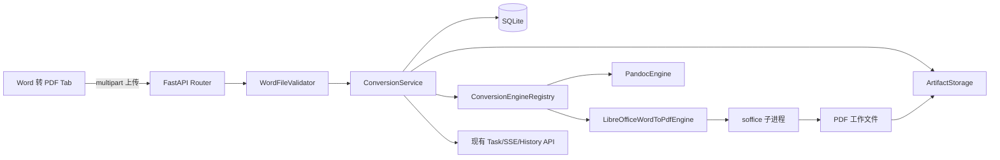

# Word 转 PDF 后端设计

> 状态：四引擎选择、状态检测、任务路由与 LibreOffice 一键安装已实现  
> 日期：2026-08-09  
> 适用范围：MarkFlow 桌面端的 `.docx` / `.doc` 转 PDF 功能  
> 结论：**Word→PDF 使用独立转换管线，并可按任务选择 Pandoc、WPS、Microsoft Word 或 LibreOffice；复用现有任务、SSE、历史记录和文件产物体系。**

## 0. 2026-08-09 多引擎实施更新

页面新增“导出引擎”选项，提交接口通过 multipart 字段 `engine` 接收以下值：

| ID | 实现 | 输入 | 版式特征 |
|---|---|---|---|
| `pandoc` | DOCX→HTML→Edge 打印 PDF | `.docx` | 内容重排，不能保证原分页 |
| `wps` | WPS Writer COM `ExportAsFixedFormat` | `.docx`、`.doc` | WPS 原生固定版式导出 |
| `microsoft-word` | Word COM `ExportAsFixedFormat` | `.docx`、`.doc` | Microsoft Word 原生固定版式导出 |
| `libreoffice` | Writer CLI `writer_pdf_Export` | `.docx`、`.doc` | 开源兼容导出，复杂版式可能重排 |

`WordToPdfEngineRegistry` 负责状态汇总与执行分派。状态接口返回 `engines[]`，不可用引擎仍展示在前端但禁用，并附带诊断信息。任务的 `options_json` 持久化 `engine` 与 `engine_version`，便于追踪不同导出器造成的版式差异。默认始终选择 Microsoft Word；Word 不可用时明确提示用户，并由用户主动改选其他引擎，不自动改变默认方式。

WPS/Word 仅在 Windows 且相应 COM ProgID 已注册时标记为可用。调用时文档以只读方式打开、禁用宏自动执行和交互提示，并在 `finally` 中关闭文档、退出应用、释放 COM 对象。Pandoc 方案明确标记为 `reflow`，用于结构化内容兜底，不作为高保真方案。

当前实现进度（2026-08-09）：

- 已完成 `ConversionPipeline`、数据库 `0004` 迁移和历史记录管线字段。
- 已完成 `.docx` / `.doc` 二进制结构、大小及 ZIP bomb 校验。
- 已完成 LibreOffice 路径发现、版本探测、独立 profile、PDF 参数和输出校验。
- 已完成 multipart 提交、引擎状态、现有任务/SSE/下载/历史链路接入。
- 已完成 Word 专用并发限制、超时、取消和 Windows 进程树回收。
- 已完成专项单元/API 测试；当前开发机未检测到 LibreOffice，因此尚未运行真实文档转换冒烟测试。
- 已完成设置页一键安装：官方 MSI 下载、SHA-256 校验、SSE 进度、应用私有部署及安全卸载。

## 1. 背景与结论

MarkFlow 当前转换链路面向 Markdown：前端提交 UTF-8 文本，`ConversionService` 保存源文件并调用 `PandocEngine`，转换结果进入统一的任务状态、历史记录和 artifact 存储。

Word→PDF 与现有链路有两个本质差异：

- 输入是二进制文件，不能继续放入 `ConvertRequest.content: str`。
- 目标是尽量保持 Word 的分页、字体、表格、页眉页脚和图片布局；Pandoc 会先解析再重新排版，不适合承担版式保真转换。

因此采用以下方案：

1. 新增 `LibreOfficeWordToPdfEngine`，通过受控子进程调用 LibreOffice Writer PDF 导出过滤器。
2. 将现有 `ConversionService` 演进为“任务编排 + 引擎注册表”，按 `pipeline` 选择 Pandoc 或 Word→PDF 引擎。
3. 新增 multipart 上传接口，现有任务查询、SSE、下载、历史和清理接口保持复用。
4. 每个任务使用独立的 LibreOffice 用户配置目录，限制并发、超时并清理完整进程树。
5. MVP 只支持未加密的 `.docx` 和 `.doc`；不支持 `.docm`、密码文档、修订接受、签名保留或批量转换。

## 2. 设计目标与边界

### 2.1 目标

- 支持 `.docx`、`.doc` 上传并异步转换为 PDF。
- 尽可能保留原文档分页、字体、表格、图片、目录、页眉和页脚。
- 转换全程在用户本机执行，不上传第三方服务。
- 复用现有任务 ID、进度 SSE、artifact、历史记录、下载和删除能力。
- 后端异常退出后，未完成任务仍按当前机制标记为 `interrupted`。
- 明确返回引擎缺失、文件损坏、密码保护、超时和输出缺失等可操作错误。
- 打包版本与开发环境使用同一套引擎发现规则。

### 2.2 本期不做

- 不使用在线 Office 或云转换 API。
- 不承诺与 Microsoft Word 像素级一致；最终版式仍受 LibreOffice 兼容性和本机字体影响。
- 不支持宏文档 `.docm`，也不执行任何宏。
- 不支持密码输入和加密文档解密。
- 不做 Word 内容编辑、批注处理、修订接受或数字签名保留。
- 不在转换前生成第二份临时“预览 PDF”。转换成功的正式 PDF 同时作为预览和下载源，避免重复转换。
- 不修改系统 Office 文件关联，也不卸载用户自行安装的 LibreOffice。

### 2.3 LibreOffice 模块安装

设置页的“LibreOffice PDF 引擎”采用应用托管模式：

1. 优先复用系统中已可用的 LibreOffice；系统版本只显示状态，不提供卸载。
2. 缺失时读取 Document Foundation 官方 Metalink 清单，优先选择中国/亚洲 HTTPS 镜像下载固定版本 MSI。
3. 镜像证书、连接或文件大小异常时自动切换备用镜像；下载后使用 Metalink 或官方 `.sha256` 校验，失败时删除缓存安装包。
4. 通过 Windows Installer 行政部署到 `DATA_DIR/modules/libreoffice`，无需修改系统文件关联。
5. 安装进度通过现有模块 SSE 接口返回；成功后前端立即刷新 Word 转 PDF 引擎状态。
6. 卸载只删除 MarkFlow 托管目录，不触碰系统 LibreOffice。

当前固定版本和下载地址可通过 `MARKFLOW_LIBREOFFICE_DOWNLOAD_URL`、
`MARKFLOW_LIBREOFFICE_CHECKSUM_URL` 覆盖，服务端仍强制只接受 Document Foundation 官方 HTTPS 域名。

## 3. 引擎选型

| 方案 | 版式保真 | 部署依赖 | 稳定性 | 结论 |
| --- | --- | --- | --- | --- |
| Pandoc：DOCX→PDF | 中低，会重新排版 | 已有 Pandoc，仍需 PDF 后端 | 已有经验 | 不采用 |
| LibreOffice `--headless --convert-to` | 较高 | LibreOffice | CLI 边界清晰，可隔离 | **MVP 默认** |
| Microsoft Word COM | 最高 | 用户安装并授权 Microsoft Word | 可能出现弹窗、COM 卡死、进程回收问题 | 后续可选兼容引擎 |
| 纯 Python 解析 DOCX 后生成 PDF | 低，功能覆盖不完整 | Python 库 | 维护成本极高 | 不采用 |
| 第三方云 API | 取决于供应商 | 网络、账号、费用 | 引入隐私和可用性风险 | 不采用 |

LibreOffice 官方命令行支持 `--headless`、`--convert-to`、`--outdir`，也支持通过 `-env:UserInstallation=...` 指定独立用户配置目录。PDF Writer 过滤器可配置图片质量、分辨率、书签和标准字体嵌入等选项：

- [LibreOffice 启动参数](https://help.libreoffice.org/latest/en-US/text/shared/guide/start_parameters.html)
- [LibreOffice PDF 命令行参数](https://help.libreoffice.org/latest/en-US/text/shared/guide/pdf_params.html)
- [LibreOffice 文件转换过滤器](https://help.libreoffice.org/latest/en-US/text/shared/guide/convertfilters.html)

## 4. 总体架构



### 4.1 关键设计决定

- **一个任务体系，多个转换管线**：Word 任务不新建另一套状态接口，避免历史、下载和清理能力重复实现。
- **引擎按任务持久化选择**：`pipeline` 写入数据库，不能只存在内存或依靠文件扩展名推断。
- **API 与引擎校验分层**：API 层负责快速拒绝非法上传；引擎层仍重复检查关键约束，防止内部调用绕过入口。
- **子进程隔离**：LibreOffice 不嵌入 Python 进程；每次转换使用独立 profile 和工作目录，转换结束后完整回收。
- **正式输出即预览源**：前端在任务完成后使用现有输出下载接口加载 PDF，后端不保存重复的 preview artifact。

## 5. 领域模型与数据库

### 5.1 新增转换管线枚举

```python
class ConversionPipeline(StrEnum):
    MARKDOWN = "markdown"
    WORD_TO_PDF = "word_to_pdf"
```

`ConversionTask` 新增：

```python
pipeline: ConversionPipeline = ConversionPipeline.MARKDOWN
options: dict = Field(default_factory=dict)
```

`options` 进入任务模型后，引擎从结构化配置读取参数，不再把 Word 选项塞入 Pandoc 的 `extra_args`。

### 5.2 数据库迁移

新增 `backend/migrations/versions/0004_conversion_pipeline.py`：

| 字段 | 类型 | 默认值 | 用途 |
| --- | --- | --- | --- |
| `conversion_jobs.pipeline` | `String(32) NOT NULL` | `markdown` | 选择转换引擎，并供历史页区分任务 |

现有 `options_json` 保存 Word 选项快照，无需为每个选项增加数据库列。迁移时所有旧记录回填为 `markdown`。

Word 任务数据库示例：

```json
{
  "pipeline": "word_to_pdf",
  "output_format": "pdf",
  "template_slug": null,
  "options_json": {
    "quality": "standard",
    "export_bookmarks": true,
    "embed_standard_fonts": true,
    "engine": "libreoffice",
    "engine_version": "detected-at-runtime"
  }
}
```

引擎版本应在任务开始时写回 `options_json` 或增加独立的执行元数据更新方法，以便定位不同 LibreOffice 版本导致的版式差异。

### 5.3 artifact 布局

继续使用现有目录结构：

```text
DATA_DIR/artifacts/{task_id}/
├── source/
│   └── 产品需求说明书.docx
├── work/
│   ├── 产品需求说明书.docx
│   ├── output/
│   │   └── 产品需求说明书.pdf
│   └── lo-profile/
└── output/
    └── 产品需求说明书.pdf
```

任务成功后只持久化 `source` 和 `output`；`work`、LibreOffice profile、锁文件和临时文件必须在 `finally` 中清理。

## 6. 服务与接口设计

### 6.1 引擎接口演进

现有 `ConversionEngine.convert()` 包含 Pandoc 专属参数。建议用上下文对象收口：

```python
class ConversionContext(BaseModel):
    task_id: UUID
    pipeline: ConversionPipeline
    input_path: Path
    output_format: OutputFormat
    work_dir: Path
    options: dict = Field(default_factory=dict)
    template_slug: str | None = None
    extra_args: list[str] = Field(default_factory=list)


class ConversionEngine(ABC):
    @abstractmethod
    async def convert(
        self,
        context: ConversionContext,
        on_progress: ProgressCallback | None = None,
    ) -> ConversionResult: ...
```

`PandocEngine` 只做签名适配，行为不变。新增注册表：

```python
class ConversionEngineRegistry:
    def __init__(self, engines: dict[ConversionPipeline, ConversionEngine]) -> None: ...
    def resolve(self, pipeline: ConversionPipeline) -> ConversionEngine: ...
```

`ConversionService.execute()` 根据 `task.pipeline` 解析引擎。对 Markdown 和 Word 分别设置 semaphore：

- Markdown 默认沿用 `max_concurrent_tasks = 4`。
- Word 默认 `max_concurrent_word_tasks = 2`，低内存设备可配置为 1。

不要让两个管线共享同一个总信号量，否则耗时 Word 任务会无必要阻塞 Markdown 转换。

### 6.2 提交转换

```http
POST /api/v1/word-to-pdf/convert
Content-Type: multipart/form-data
```

表单字段：

| 字段 | 类型 | 必填 | 约束 |
| --- | --- | --- | --- |
| `file` | binary | 是 | `.docx` / `.doc`，最大 50 MiB |
| `output_file_name` | string | 否 | 最长 255，最终强制 `.pdf` |
| `quality` | enum | 否 | `screen` / `standard` / `print`，默认 `standard` |
| `export_bookmarks` | bool | 否 | 默认 `true` |
| `embed_standard_fonts` | bool | 否 | 默认 `true` |

响应继续使用 `ConvertResponse`：

```json
{
  "task_id": "7de9f286-f68b-42be-b9ec-fb68975e43f1",
  "status": "pending",
  "message": "任务已提交"
}
```

使用独立 endpoint 而不是扩展现有 `/convert`，原因是现有接口为 JSON 文本请求；强行兼容二进制会导致 schema、请求体上限和前端调用方式都变得含糊。

### 6.3 状态、进度、下载和历史

直接复用：

- `GET /api/v1/tasks/{task_id}`
- `GET /api/v1/tasks/{task_id}/progress`
- 现有任务输出下载接口
- `GET /api/v1/history`
- `GET /api/v1/history/{task_id}/{kind}`
- 现有历史删除与清空接口

`HistoryItemResponse` 增加 `pipeline` 字段，前端据此显示“Word 转 PDF”，而不是只根据 `output_format=pdf` 猜测来源。

### 6.4 引擎状态

```http
GET /api/v1/word-to-pdf/status
```

```json
{
  "available": true,
  "engine": "libreoffice",
  "version": "26.2.0.3",
  "executable": "C:\\Program Files\\LibreOffice\\program\\soffice.com",
  "supported_inputs": ["docx", "doc"],
  "diagnostic": "LibreOffice Writer PDF 导出已就绪"
}
```

生产响应可隐藏完整绝对路径，只在 debug 模式或日志中返回 `executable`。状态检测顺序：

1. `MARKFLOW_LIBREOFFICE_PATH` 显式配置。
2. `DATA_DIR/modules/libreoffice/program/soffice.com` 托管模块。
3. Windows 常见安装路径与注册表安装位置。
4. `PATH` 中的 `soffice.com` / `soffice`。

Windows 优先调用 `soffice.com`，便于可靠获取 stdout、stderr 和返回码。

## 7. 文件校验与安全

### 7.1 上传校验

校验顺序：

1. 文件名必须有且扩展名为 `.docx` 或 `.doc`，扩展名按小写比较。
2. 流式读取并在读取过程中执行 50 MiB 上限，不能只信任 `Content-Length`。
3. `.docx` 文件头必须为 ZIP，并至少包含 `[Content_Types].xml` 与 `word/document.xml`。
4. `.doc` 文件头必须符合 OLE Compound File 签名 `D0 CF 11 E0 A1 B1 1A E1`。
5. `.docx` 预检查 ZIP 条目数量、总解压大小和压缩比，拒绝 ZIP bomb：
   - 条目数不超过 10,000；
   - 总解压大小不超过 500 MiB；
   - 单条目压缩比不超过 100:1。
6. 文件名通过现有 `_safe_filename()` 处理，任何工作路径必须再次做目录包含校验。

MIME 类型只用于辅助判断，不能作为唯一可信依据。

### 7.2 子进程安全

- 使用参数数组调用 `asyncio.create_subprocess_exec()`，禁止 `shell=True`。
- 输入、输出和 profile 路径都由后端生成，不接收用户提供的任意路径。
- 每个任务设置独立 `UserInstallation`，避免连接到用户已打开的 LibreOffice 进程。
- 使用 `--headless --nologo --nodefault --nolockcheck --nofirststartwizard --norestore`。
- 配置宏安全为最高等级；不支持 `.docm`，不加载用户 profile、扩展或脚本。
- 默认超时 180 秒；超时后终止完整进程树，而不是只结束父进程。
- stdout/stderr 最多保留末尾 64 KiB，避免异常输出占满内存或日志。
- 仅当返回码为 0、预期 PDF 存在、大小大于 0 且文件头为 `%PDF-` 时才判定成功。

Windows 可在后续使用 Job Object 保证 sidecar 退出时子进程一并终止；MVP 至少使用 `CREATE_NEW_PROCESS_GROUP` 并在超时时执行受控的进程树终止。

### 7.3 隐私

- 后端只监听 `127.0.0.1`，保持当前配置。
- 日志不得记录文档正文、解压内容或完整用户目录。
- 正常日志只记录 task ID、清理后的文件名、文件大小、引擎版本、耗时和错误码。
- 源文件和 PDF 遵循现有历史记录生命周期；工作副本无论成功或失败都立即清理。

## 8. LibreOffice 执行设计

### 8.1 命令构造

概念命令如下，实际实现必须通过参数数组执行：

```text
soffice.com
  -env:UserInstallation=file:///.../work/lo-profile
  --headless
  --nologo
  --nodefault
  --nolockcheck
  --nofirststartwizard
  --norestore
  --convert-to pdf:writer_pdf_Export:{...JSON options...}
  --outdir .../work/output
  .../work/document.docx
```

`UserInstallation` 使用 `Path.as_uri()` 生成合法 file URI，不能手工拼接 Windows 盘符路径。

### 8.2 质量预设映射

| UI 选项 | `Quality` | `ReduceImageResolution` | `MaxImageResolution` | 用途 |
| --- | ---: | --- | ---: | --- |
| `screen` | 75 | true | 150 | 屏幕阅读，体积优先 |
| `standard` | 90 | true | 300 | 默认，质量与体积平衡 |
| `print` | 100 | false | 不设置 | 打印与归档，保留原图分辨率 |

通用映射：

| 后端选项 | LibreOffice PDF 属性 |
| --- | --- |
| `export_bookmarks` | `ExportBookmarks` |
| `embed_standard_fonts` | `EmbedStandardFonts` |
| 默认可访问性 | `UseTaggedPDF=true` |
| PDF 版本 | `SelectPdfVersion=0`（PDF 1.7 默认值） |

注意：`EmbedStandardFonts` 只控制 PDF 标准字体，不等于可以补齐系统中缺失的中文或商业字体。字体未安装时 LibreOffice 会替换字体，后端应在错误提示和产品文案中明确这一点。

### 8.3 进度模型

LibreOffice CLI 不提供细粒度百分比，因此采用阶段进度，不伪造逐页进度：

| 进度 | 阶段 | 消息 |
| ---: | --- | --- |
| 0.05 | validate | 正在校验 Word 文件 |
| 0.15 | prepare | 正在准备转换环境 |
| 0.25 | start_engine | 正在启动 PDF 转换引擎 |
| 0.80 | verify | 正在校验 PDF 输出 |
| 0.90 | persist | 正在保存转换结果 |
| 1.00 | completed | 转换完成 |

引擎执行期间可每 5 秒发送相同阶段的 SSE 心跳，但不增加百分比。这样前端能确认任务仍在运行，又不会展示虚假进度。

## 9. 错误模型

新增稳定错误码，API 的 `detail` 可继续返回中文说明，日志保留底层诊断：

| 错误码 | HTTP/任务状态 | 用户提示 | 典型原因 |
| --- | --- | --- | --- |
| `WORD_ENGINE_UNAVAILABLE` | 503 / 提交失败 | 未检测到 Word 转 PDF 引擎 | LibreOffice 未安装或路径失效 |
| `UNSUPPORTED_WORD_FORMAT` | 400 / 提交失败 | 仅支持 .docx 和 .doc | 扩展名不支持 |
| `INVALID_WORD_FILE` | 400 / 提交失败 | Word 文件已损坏或格式不正确 | 签名、ZIP 结构不合法 |
| `WORD_FILE_ENCRYPTED` | failed | 暂不支持密码保护的 Word 文件 | 引擎要求密码或输出缺失 |
| `WORD_CONVERSION_TIMEOUT` | failed | 文档转换超时 | 大文件、复杂对象或引擎卡死 |
| `WORD_CONVERSION_FAILED` | failed | Word 转 PDF 失败 | LibreOffice 返回非零状态 |
| `PDF_OUTPUT_INVALID` | failed | 生成的 PDF 文件无效 | 输出为空、文件头错误 |
| `WORD_FONT_SUBSTITUTED` | completed + warning | 部分字体可能已被替换 | 本机缺少源文档字体 |

现有 `TaskStatusResponse` 只有 `status` 和 `progress`，建议扩展为：

```python
class TaskStatusResponse(BaseModel):
    task_id: str
    status: str
    progress: float
    stage: str = ""
    message: str = ""
    error_code: str | None = None
    error_message: str | None = None
    warnings: list[str] = Field(default_factory=list)
```

这项扩展对现有前端向后兼容，同时使 Word 页面无需解析日志文本。

## 10. 配置与模块管理

`AppSettings` 新增：

```python
libreoffice_path: Path | None = None
word_conversion_timeout: int = 180
max_concurrent_word_tasks: int = 2
word_max_uncompressed_size: int = 500 * 1024 * 1024
```

环境变量：

```text
MARKFLOW_LIBREOFFICE_PATH
MARKFLOW_WORD_CONVERSION_TIMEOUT
MARKFLOW_MAX_CONCURRENT_WORD_TASKS
MARKFLOW_WORD_MAX_UNCOMPRESSED_SIZE
```

新增 `LibreOfficeManager`，职责与 `PandocManager` 类似但首期只做：

- 路径发现和缓存；
- `--version` 探测；
- 最小自检（将内置小型 DOCX 转换为 PDF）；
- 状态与诊断信息；
- 检测失败后允许强制刷新。

后续托管安装版本可接入现有 `/modules/{module_id}/progress`，模块 ID 使用 `libreoffice`。安装包必须固定版本、校验 SHA-256、携带许可证与第三方声明；安装/卸载属于独立迭代，不与转换 MVP 绑在一起。

## 11. 代码变更清单

建议新增：

```text
backend/app/core/word_to_pdf_engine.py       # LibreOffice 引擎与 PDF 参数构造
backend/app/core/libreoffice_check.py        # 引擎发现、版本与自检
backend/app/core/engine_registry.py          # pipeline -> engine
backend/app/services/word_file_validator.py  # DOCX/DOC 与 ZIP bomb 校验
backend/migrations/versions/0004_conversion_pipeline.py
backend/tests/unit/test_word_file_validator.py
backend/tests/unit/test_word_to_pdf_engine.py
backend/tests/unit/test_libreoffice_check.py
backend/tests/integration/test_word_to_pdf.py
```

建议修改：

```text
backend/app/models/models.py                 # ConversionPipeline、任务字段
backend/app/core/interfaces.py               # ConversionContext
backend/app/core/engine.py                   # PandocEngine 适配新接口
backend/app/services/converter.py            # 注册表分派、分管线 semaphore
backend/app/services/artifact_storage.py      # 暴露受控 work_dir/profile 目录
backend/app/db/models.py                      # pipeline 列
backend/app/db/repository.py                  # pipeline/options 持久化与恢复
backend/app/api/schemas.py                    # Word options/status、增强任务状态
backend/app/api/router.py                     # 新转换与状态 endpoint
backend/app/main.py                           # 组装 LibreOffice 引擎与注册表
backend/app/utils/config.py                   # Word 引擎配置
markflow_backend.spec                         # 如后续携带自检 DOCX/安装资源
```

## 12. 测试策略

### 12.1 单元测试

- `.docx` 合法 ZIP、缺失关键条目、ZIP bomb、伪扩展名。
- `.doc` 合法/非法 OLE 签名。
- 文件大小边界：0、50 MiB、超过 50 MiB。
- 输出文件名清理与 `.pdf` 后缀强制。
- 三档质量预设生成的 JSON 参数准确。
- 命令参数中包含独立 profile、受控 outdir，且没有 `shell=True`。
- 返回码非零、超时、PDF 缺失、空 PDF、错误文件头。
- 路径中包含空格、中文、`#`、`%` 时仍能正确转换。
- 并发任务得到不同 profile，不发生锁冲突。
- `pipeline` 数据迁移与旧历史回填。

### 12.2 集成测试

准备小型、可审查且不含隐私内容的 fixture：

- 普通 DOCX：标题、正文、中文字体、分页。
- 表格和合并单元格。
- 页眉页脚、页码、目录和书签。
- 图片、浮动对象和横向页面。
- 旧版 `.doc`。
- 损坏、密码保护、超大压缩比文档。

集成测试断言：

- 任务从 pending → running → completed/failed。
- 输出为有效 PDF，页数大于 0。
- 源文件和输出 artifact 的哈希、大小、MIME 正确。
- 历史详情 `pipeline=word_to_pdf`，下载可用。
- 成功、失败和超时后 `work` 与 profile 都被清理。
- 后端重启后完成任务仍可查询，运行中任务变为 interrupted。

版式回归测试不只比较 PDF 字节：固定 LibreOffice 版本和字体环境，将 PDF 页面渲染为 PNG，再做容差化视觉差异比较。PDF 元数据和对象顺序可能变化，直接哈希不适合判断版式是否回归。

### 12.3 验收标准

- 20 MiB 以内的常规 DOCX 在默认 180 秒内完成转换。
- 连续转换 50 次无残留 LibreOffice 进程、profile 或锁文件。
- 同时执行 2 个 Word 任务不会串文件或覆盖输出。
- 中英文文件名、空格路径和长文件名可正常处理。
- 转换失败时 UI 能显示稳定错误码对应的中文提示。
- 输出可由主流 PDF 阅读器打开，历史记录可再次下载。

## 13. 实施顺序

### 阶段一：引擎最小闭环

1. 实现 `LibreOfficeManager` 与状态 endpoint。
2. 实现文件校验器和 `LibreOfficeWordToPdfEngine`。
3. 用本地 fixture 验证命令、超时、输出校验和清理。

### 阶段二：接入统一任务体系

1. 增加 `ConversionPipeline` 与 `0004` 数据迁移。
2. 引入 engine registry，适配现有 Pandoc 引擎。
3. 新增 multipart 提交接口，复用任务、SSE、artifact 和历史。
4. 扩展任务状态错误信息与警告。

### 阶段三：桌面端与发布

1. 前端接入状态检测、上传、转换进度、预览与下载。
2. 在设置页展示 LibreOffice 引擎状态和诊断。
3. 完成 Windows 打包环境、中文路径和进程回收测试。
4. 评估是否将 LibreOffice 做成可选托管模块。

## 14. 风险与取舍

| 风险 | 影响 | 缓解措施 |
| --- | --- | --- |
| 本机缺少字体 | 换行、分页变化 | 显示字体替换风险；发布字体兼容清单 |
| LibreOffice 版本差异 | 输出细节不一致 | 记录 engine version；发布测试固定版本 |
| 复杂文档使引擎卡死 | 任务长期占用资源 | 180 秒超时、独立进程、完整进程树回收 |
| 用户已打开 LibreOffice | profile/锁冲突 | 每任务独立 `UserInstallation` |
| 并发占用内存较高 | 桌面卡顿 | Word 专用 semaphore，默认并发 2 |
| `.doc` 兼容性较弱 | 少数旧文档失败 | 保留稳定错误码；后续评估 Word COM fallback |
| “嵌入字体”理解过度 | 用户期待所有字体都能补齐 | 文案说明只嵌入可用字体，缺失字体仍会替换 |
| 托管 LibreOffice 增大安装包 | 发布体积上升 | MVP 先检测系统安装，模块化安装独立迭代 |

## 15. 最终建议

首个可发布版本应坚持以下最小范围：

- LibreOffice 单一默认引擎；
- `.docx` 与 `.doc`，最大 50 MiB；
- 标准/屏幕/打印三档质量、书签、标准字体嵌入；
- 独立 profile、180 秒超时、Word 并发 2；
- 统一任务、SSE、历史和 artifact；
- 不做密码文档、宏、批量转换、自动安装和 Word COM fallback。

这条路径能在不破坏现有 Markdown 转换功能的前提下形成完整闭环，同时为后续增加托管 LibreOffice 模块或 Microsoft Word 高保真兼容引擎保留清晰扩展点。
